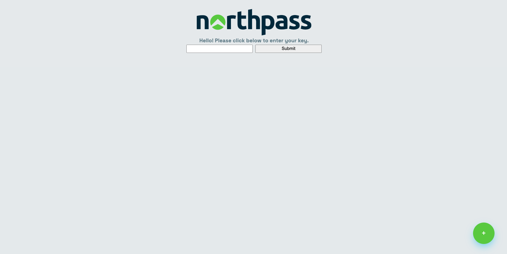
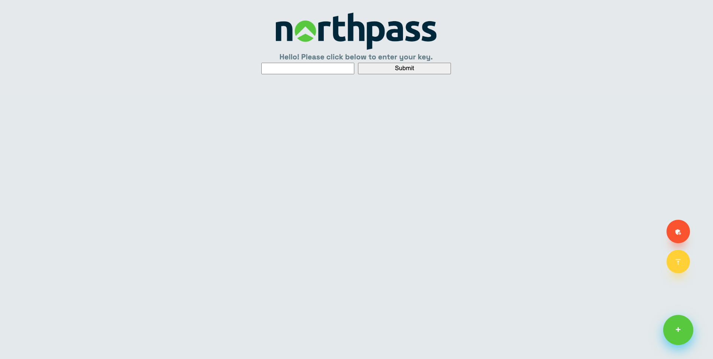
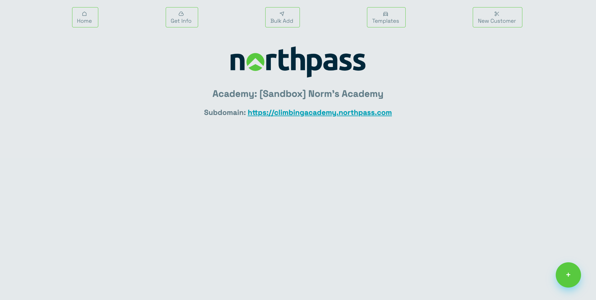
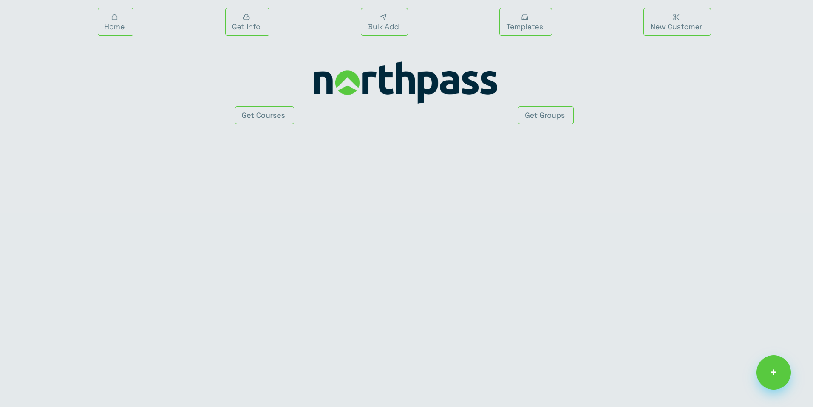
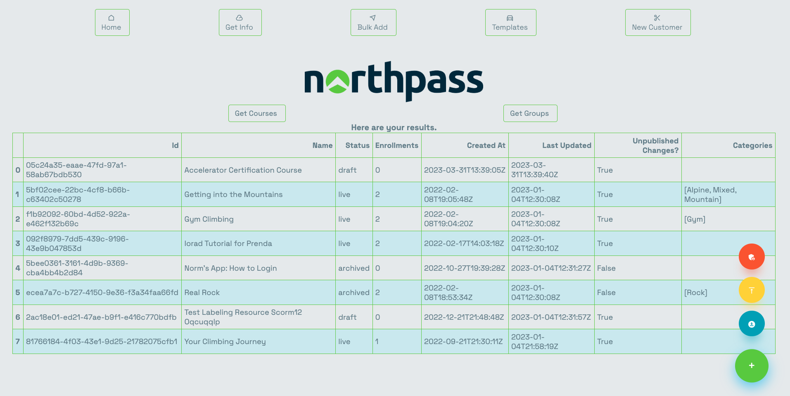
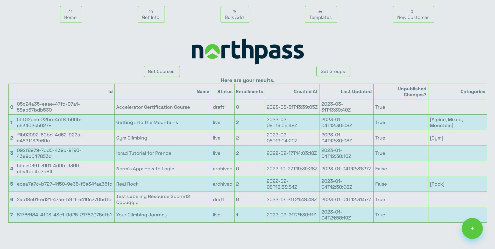
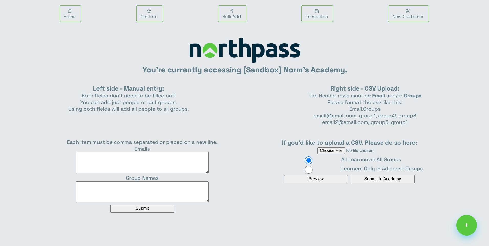
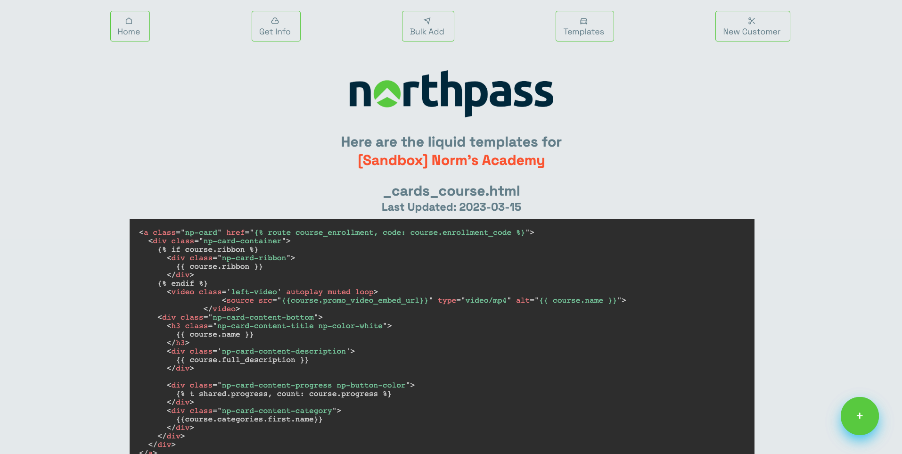
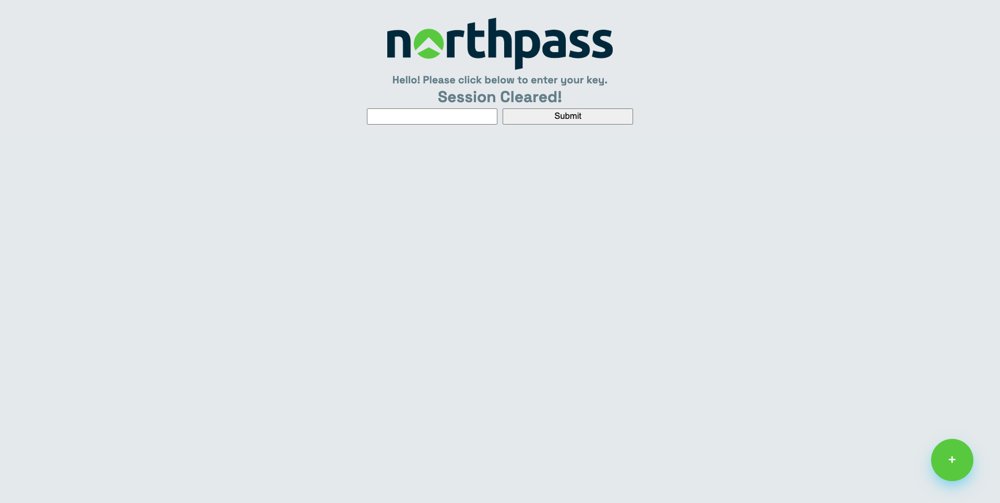

<p align="center">
<h1> Northpass Admin App </h1>
</p>
<p align="center">
  
</p>

## Overview

This app is a minimal Flask app that I created this project as a weekend-task to help me with a few tools and references at work. Northpass has unbelievably robust API Documentation with a ton of useful endpoints that are always being improved and changed. You can find the documentation [here](https://developers.northpass.com). There are a few items that can either be hard to find or aren't easily exportable via CSV.

Since I am not a developer and therefore don't have db access, this app acts as an ephemeral, isolated environment that
requires an API key to access. You will need to be an admin in a Northpass instance to leverage any of the tools here.
There was also the thought of offering this access to other Northpass CSMs to attempt to solve customer issues without
needing to go to Solutions Engineering, or, begin finding the solution for the Solutions team.

This app offers the following to non-SE team members:

* Ability to bulk create groups and people
* Ability to bulk add people to groups.
* Download CSV of groups with number of members.
* Download CSV of Courses with Categories and other data.
* View all templates without the need to download and open in an IDE.
* Submit template changes directly via the browser.

The app offers the following security considerations:

* Clear Session/Timeout after 5 minutes
* Button to switch to a new academy/API key (which also clears all session data)
* No DELETE requests via the UI

Todo List & Warnings:

[ ] Add additional functions for "Get Info" section
[ ] Create function that deletes all files created during the Session.

##### WARNING

*What this last one means is that if you use this app frequently or across many academies, you could easily take up unnecessary space! It is recommended to clean, destroy, and re-create the image every once in a while.* !!!

### Running this app

#### Docker

I've provided a Dockerfile with instructions below on how to run this app on your computer. Run the following commands:

```bash
git clone https://github.com/normanras/northass_admin_tool.git
cd northpass_admin_tool

# For most systems, use:
docker build -t northpass_admin_tool .

# For MacOS with Docker Desktop, use:
docker buildx build -t northpass_admin_tool .

docker run -d -p 5005:5000 --name northpass_admin_cntr northpass_admin_tool
```

By default, Flask runs on port 5000 and you may already have something listening on that port. Change the `-p` argument to another open port. In the example above, I've used `5005`, but you can use whatever you'd like.


#### Flask

Download this repo

`git clone https://github.com/normanras/northpass_admin_tool.git`

Navigate to the root directory

`cd northpass_admin_tool/app && flask run`

Below are a few screenshots of the project.










